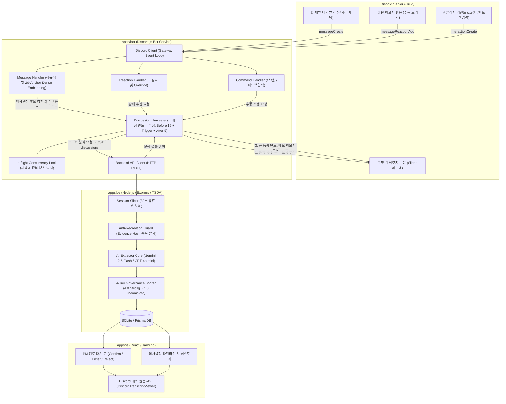
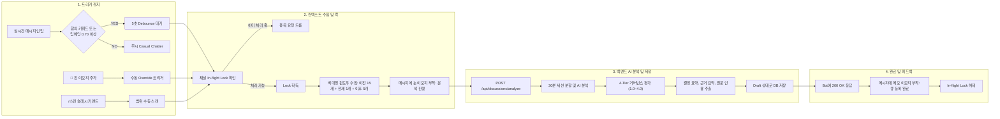
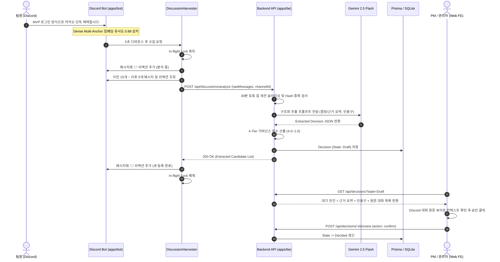

# Discord Bot 구성 및 아키텍처 다이어그램 (Discord Bot Architecture)

이 문서는 GGADDAK 의사결정 추적 시스템의 **Discord Bot (`apps/bot`) 내부 구성, 이벤트 핸들링 파이프라인, 그리고 백엔드/프론트엔드와의 연동 아키텍처**를 설명합니다.

---

## 1. 전체 시스템 통합 아키텍처 (High-Level Topology)

---

## 2. Discord Bot 내부 처리 파이프라인 (Bot Ingestion & Analysis Flow)

---

## 3. 세부 컴포넌트 시퀀스 다이어그램 (End-to-End Sequence Diagram)

---

## 4. 디스코드 봇 핵심 모듈 구조 (Module Breakdown)

- **`src/bot/client.ts`**: Gateway Intents (`Guilds`, `GuildMessages`, `MessageContent`, `GuildMessageReactions`) 구성 및 클라이언트 인스턴스화.
- **`src/handlers/message.handler.ts`**:
  - `evaluateDenseMultiAnchorSimilarity`: 20개 의사결정 앵커 벡터와의 최대 코사인 유사도가 0.70 이상이거나 키워드 매칭 시 트리거.
  - 5초 슬라이딩 디바운스로 연속 대화 수렴 대기.
- **`src/handlers/reaction.handler.ts`**: 📌 이모지 반응 시 안티 재추출 해시 무시하고 즉각 강제 재분석 실행.
- **`src/commands/`**: `/스캔` (특정 범위 메시지 스캔), `/피드백입력` (외부 피드백 등록) 슬래시 커맨드.
- **`src/services/harvester.service.ts`**:
  - 채널별 동시 실행 방지 `Set<string>` Lock 관리.
  - 비대칭 윈도우 수집 (Before 15, After 5).
  - Silent 모드: 채널 텍스트 발송 없이 `👀` ➔ `📝` 이모지만으로 상태 전달.
- **`src/services/backend-api.service.ts`**: 백엔드 REST 엔드포인트(`POST /api/discussions/analyze`) 통신.
